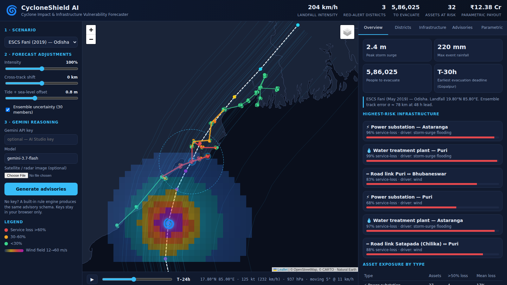

# 🌀 CycloneShield AI
### Cyclone Impact & Infrastructure Vulnerability Forecaster
**Build with AI: Code for Communities — Second Edition · Track 5**

> Move disaster response from *post-landfall recovery* to *pre-landfall action*: simulate a Bay of Bengal cyclone, forecast storm surge, rainfall and wind damage down to individual substations, hospitals, shelters and roads, and auto-generate multilingual early-warning advisories with Gemini — 24–72 hours before landfall.

| | |
|---|---|
| 🌐 **Live prototype** | https://ravirepswal108-lgtm.github.io/cycloneshield-ai/ |
| 💻 **Source** | https://github.com/ravirepswal108-lgtm/cycloneshield-ai |
| 📊 **Pitch deck** | [`docs/CycloneShield_AI_Deck.pdf`](docs/CycloneShield_AI_Deck.pdf) |
| 🎬 **Demo video** | [`docs/demo.mp4`](docs/demo.mp4) |



---

## 1. The problem

Cyclones in the Bay of Bengal (Fani 2019, Amphan 2020, Yaas 2021, Dana 2024) repeatedly hit Odisha, West Bengal, Andhra Pradesh and Bangladesh. India has become excellent at **evacuating people** — but the next frontier of loss is **infrastructure and livelihoods**:

* After Fani, Puri and Bhubaneswar lost power for **1–3 weeks**; hospitals, water plants and telecom failed in cascade because the grid failed.
* Evacuation routes get blocked by tree-fall and flooding, isolating shelters.
* District officials receive a *track forecast* (where the storm goes), not an *impact forecast* (what will break, where, and when to act).
* Relief money arrives weeks after loss assessment, when the most vulnerable (fishers, salt farmers, SHGs) have already sold assets.

## 2. Our solution

CycloneShield AI converts a cyclone forecast into an **impact-based, asset-level, time-bound action plan**:

1. **Simulate the hazard** — wind field, storm surge + tide, rainfall — along the forecast track, hour by hour.
2. **Map exposure** of critical infrastructure (power substations, hospitals, cyclone shelters, arterial roads, water plants, telecom towers, ports) and population in low-elevation coastal zones (Google Earth Engine).
3. **Predict damage pathways** with fragility curves and **cascading dependencies** (grid → hospital / water / telecom; road → shelter access).
4. **Quantify uncertainty** with a 30-member ensemble (track & intensity perturbations) → probability of damaging winds per town.
5. **Reason & communicate with Gemini** — situation summary, district advisories in English + Odia / Bengali / Telugu SMS, infrastructure-hardening tasks with T-minus deadlines, and multimodal interpretation of satellite / radar images.
6. **Dispatch** as **CAP 1.2 XML** (the standard used by India's NDMA SACHET platform & cell broadcast), SMS, and district WhatsApp groups.
7. **Release money early** — parametric insurance triggers computed on modelled wind at insured locations, estimating payouts *before* landfall.

## 3. Features (what you can click in the prototype)

| Area | What it does |
|---|---|
| **Scenario engine** | Replay **ESCS Fani (2019)** or **SuCS Amphan (2020)** tracks, or build a **custom what-if cyclone** (landfall point, heading, intensity, speed). |
| **Forecast adjustments** | Intensity ±30 %, cross-track shift ±150 km, tide / sea-level-rise offset, ensemble on/off — everything recomputes instantly in the browser. |
| **Time slider & animation** | T-72 h → T+36 h: live wind field, storm position, pressure, motion. |
| **Map layers** | Wind swath grid, forecast track, ensemble tracks + landfall uncertainty cone, surge/inundation bubbles, infrastructure coloured by service-loss probability (click for details). |
| **Overview** | Peak surge, max rainfall, people to evacuate, earliest evacuation deadline, top-risk assets, exposure by asset type. |
| **Districts** | IMD-style colour-coded alert (Red/Orange/Yellow/Green), wind, surge, inundation, rainfall, evacuees vs. functional shelter capacity (⚠ shortfall), evacuation deadline, ensemble probability. |
| **Infrastructure** | Every asset ranked by risk with its main damage driver and cascade cause. |
| **Advisories** | Gemini (or offline rule engine) bulletins, multilingual SMS, infra-hardening checklist with deadlines, damage pathways, CAP-XML viewer, one-click dispatch log, JSON export. |
| **Parametric** | Tiered wind triggers (≥33 / ≥42 / ≥50 m/s) → payout per policy and pre-landfall liquidity total. |

## 4. How it works (science)

All models run client-side in [`js/model.js`](js/model.js):

| Component | Method |
|---|---|
| **Wind field** | Normalised **Holland (1980)** parametric profile, `V(r) = Vmax·√[(Rm/r)^B · e^(1-(Rm/r)^B)]`, B from central pressure; + forward-motion asymmetry (stronger right of track in the Northern Hemisphere); surface-roughness reduction inland. |
| **Storm surge** | Peak surge = 0.033 m/hPa × pressure deficit × **continental-shelf amplification factor** (shallow Hooghly/Sundarbans ≫ steep Andhra coast) + wind set-up; decays alongshore from landfall (Gaussian in 3.2·Rmax), 0.4× on left of track; + tide/SLR; inland attenuation vs. distance-to-coast; inundation depth = water level − ground elevation of low-lying fringe. |
| **Rainfall** | R-CLIPER-style radial rain-rate model, core rate = f(Vmax), exponential decay outside Rmax, integrated hourly along the track. |
| **Damage** | Lognormal **fragility curves** per asset type for wind (m/s), flood depth (m) and rainfall (mm): `P = Φ(ln(x/θ)/β)`, combined as independent failure modes. |
| **Cascades** | Power-dependent assets: `P_service = 1−(1−P_direct)(1−0.6·P_substation)` (40 % backup gen.). Shelters: `1−(1−P)(1−0.5·P_access-road)`. |
| **Evacuation** | Population in inundation zone + share of kutcha housing under damaging winds; deadline = gale-force (34 kt) onset − 6 h; compared with functional shelter capacity. |
| **Uncertainty** | 30-member Monte-Carlo ensemble: cross-track error σ = 25 km + 1.1 km/h × lead time (≈ IMD track-error growth), intensity ±10 %. |
| **Alerts** | IMD colour thresholds on wind (17.5 / 28 / 42 m/s), rain (115 / 204 mm) and inundation (0.3 / 1.0 m). |

**Sanity check vs. history:** Fani replay gives ~206 km/h at Puri (observed ≈ 175–200 km/h), 150–220 mm rain along the Puri–Bhubaneswar corridor, and Bhubaneswar/Puri substations as the top failure points — matching the real-world grid collapse. Amphan replay puts Sagar Island / Kakdwip / Gosaba on Red/Orange with ~106 km/h at Kolkata (observed ≈ 112 km/h).

## 5. Google technologies

| Technology | Role |
|---|---|
| **Gemini (Flash, multimodal)** — `js/gemini.js` | Converts model output into a structured JSON situation report, district advisories, native-language SMS, infrastructure actions & damage pathways; interprets uploaded satellite / radar / drone images. Model name configurable (default `gemini-3.7-flash` as per the challenge brief). |
| **Google Earth Engine** — `gee/cyclone_exposure.js` | Copernicus DEM low-elevation coastal zones, WorldPop population exposure, ESA WorldCover built-up/cropland, **Sentinel-1 SAR flood mapping** for validation, **GPM IMERG** rainfall, district exposure export (FAO GAUL). |
| **Google AI Studio** | API key issuance for Gemini. |
| **Firebase / Cloud Run (roadmap)** | Hosting, scheduled ingestion of IMD / JTWC advisories, FCM push to officials. |

## 6. Architecture

```
 IMD / JTWC track forecast ─┐            Google Earth Engine (DEM, WorldPop, WorldCover,
 (or scenario / what-if)    │            Sentinel-1 SAR, GPM IMERG)  ──► exposure layers
                            ▼                                              │
                ┌─────────────────────────┐                               ▼
                │  Hazard engine (JS)      │   wind · surge · rain  ┌────────────────────┐
                │  Holland + surge + RCLIPER├──────────────────────► │ Impact engine       │
                └─────────────────────────┘                        │ fragility + cascades │
                        ▲  ensemble (30)                            │ evacuation, alerts   │
                        │                                           └─────────┬──────────┘
                        │                                                     ▼
                 Uncertainty (P≥33 m/s)                     ┌──────────────────────────────┐
                                                            │ Gemini multimodal reasoning   │
                                                            │ advisories · SMS · actions    │
                                                            └───────┬───────────────┬──────┘
                                                                    ▼               ▼
                                                   CAP 1.2 XML → SACHET /      Parametric insurance
                                                   cell broadcast / SMS / WA   triggers & payouts
```

## 7. Project structure

```
cycloneshield-ai/
├── index.html              # Single-page dashboard
├── css/style.css           # UI styles (responsive)
├── js/
│   ├── data.js             # Scenario tracks, towns, asset archetypes & fragilities, insurance policies
│   ├── model.js            # Hazard, damage, cascade, ensemble engine
│   ├── gemini.js           # Gemini API client, prompt, offline advisory engine, CAP-XML
│   └── app.js              # Map (Leaflet) + UI controller
├── gee/cyclone_exposure.js # Google Earth Engine exposure pipeline
├── data/land.js            # Offline coastline (Natural Earth) so the map works without tiles
├── vendor/leaflet/         # Vendored Leaflet 1.9.4
└── docs/                   # Pitch deck (PDF), demo video, screenshot
```

## 8. Run it

No build step, no backend.

```bash
git clone https://github.com/ravirepswal108-lgtm/cycloneshield-ai
cd cycloneshield-ai
python3 -m http.server 8000     # or any static server
# open http://localhost:8000
```

**Gemini:** paste an API key from [Google AI Studio](https://aistudio.google.com/apikey) in the left panel and press *Generate advisories* (optionally attach a satellite image). The key stays in your browser. Without a key, the offline rule engine produces the same schema so the demo always works.

**Earth Engine:** open [`gee/cyclone_exposure.js`](gee/cyclone_exposure.js) in the [GEE Code Editor](https://code.earthengine.google.com) and click *Run*; export the district table to feed real exposure into `js/data.js`.

## 9. Demo walkthrough (2 minutes)

1. Default **Fani** scenario loads at T-24 h. Press ▶ to animate the storm to landfall.
2. Header shows landfall intensity, Red-alert districts, people to evacuate, assets at risk, parametric payout.
3. **Overview** → Bhubaneswar & Puri substations top the risk list; hospitals inherit risk via *grid-outage cascade*.
4. **Districts** → Puri/Jagatsinghpur Red; evacuation deadlines in T-minus hours; ⚠ where shelters are short.
5. Move **Cross-track shift** to +100 km → risk moves north-east to Balasore/Digha; turn intensity to 120 % → more Reds.
6. Switch to **Amphan** → Sundarbans surge, Kolkata grid.
7. **Generate advisories** → Odia/Bengali SMS, CAP-XML, *Dispatch all Red/Orange*.
8. **Parametric** → payouts triggered for fisher cooperative & SHGs before landfall.

## 10. Impact

* **Lives:** evacuation deadlines per town, shelter shortfall warnings, local-language SMS.
* **Infrastructure:** ranked, time-bound hardening list (pre-emptive substation shutdown, DG fuel, JCB staging) → faster restoration.
* **Livelihoods:** parametric payouts released pre-landfall to fishers, salt farmers, SHGs, MSMEs.
* **Scalable:** runs in any browser, offline-capable, CAP-compatible → plugs into NDMA SACHET, OSDMA, WBDMA and Bangladesh CPP.

## 11. Limitations & honest notes

* Scenario tracks are rounded reconstructions of IMD best-track data; the infrastructure layer is an **illustrative dataset anchored on real towns** — production use replaces it with OSM / Bhuvan / utility GIS exports via the GEE pipeline.
* Surge model is a fast parametric screening model, not a hydrodynamic model (ADCIRC / IIT-D surge model); it is designed to be calibrated/replaced with operational surge guidance.
* Fragility parameters are literature-informed defaults (HAZUS-style) and should be calibrated with state-utility damage records.
* Dispatch is simulated; CAP XML is generated with `status=Exercise`.

## 12. Roadmap

1. Live ingestion of IMD RSMC New Delhi / JTWC advisories (Cloud Run scheduler).
2. Replace illustrative assets with OSM + state utility GIS through Earth Engine.
3. ML surge emulator trained on historical ADCIRC/ INCOIS runs; Gemini-assisted post-event SAR damage verification.
4. Firebase auth for district officials, FCM push, audit trail for dispatched alerts.
5. Integration with state disaster-risk-pool parametric products.

## 13. Team

**Ravi Repswal** — Build with AI: Code for Communities, Second Edition (Hack2Skill × Google).

## License

MIT — see [LICENSE](LICENSE).
